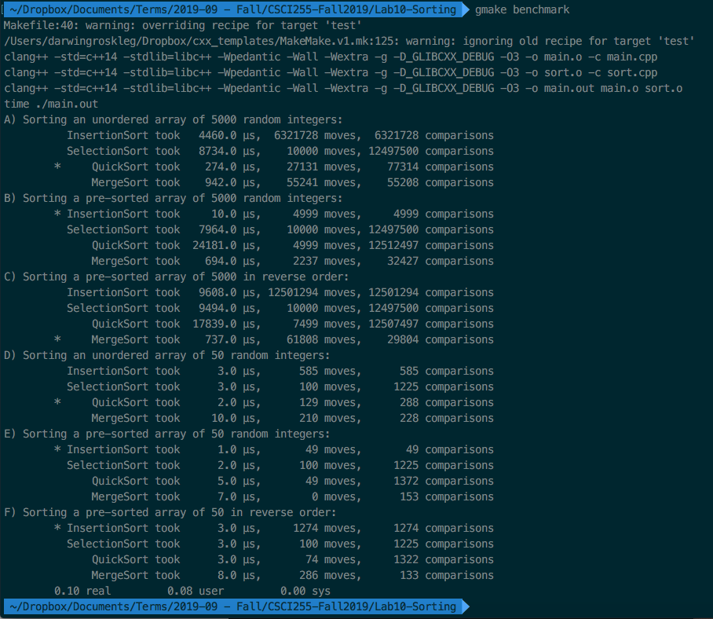

# Program Output & Questions

{width=100%}

## Q1. Are the set of timings for n=5000 as you expected?

I expected either QuickSort or MergeSort to be fastest given their
average running time of O(n log n), leaning towards QuickSort since
there's no need to make copies. This was true for case A.

Case B (pre-sorted) with InsertionSort being fastest was a surprise
given its time complexity of O(n^2) but makes sense when you notice that
it had the fewest number of comparisons by far. This from its adaptive
property.

MergeSort winning case C is reasonable given its time complexity, while
Quicksort had significantly fewer moves MergeSort made 3 magnitudes of
fewer comparisons. This makes sense since the MergeSort implementation
used does a few more moves than is necessary while still correct.

## Q2. Which algorithm is better for data already almost ordered?

The generally poor InsertionSort is the best algorithm to use for data
that is almost ordered. Performing significantly better than the others.

## Q3. Is the timings with n=50 as expected?

The timings with n=50 were not as expected if making predictions based
on time and spacde complexity of the algorithms. Overall InsertionSort
faired the best, with it being tied with SelectionSort for
reverse-ordered data. This is expected because InsertionSort has a
smaller constant factor than QuickSort/MergeSort (i.e. overhead) so when
n is small those factors are more prominent in the performance.
The overhead does however seem algorithmic, using optimizations does not
seem to improve performance.
