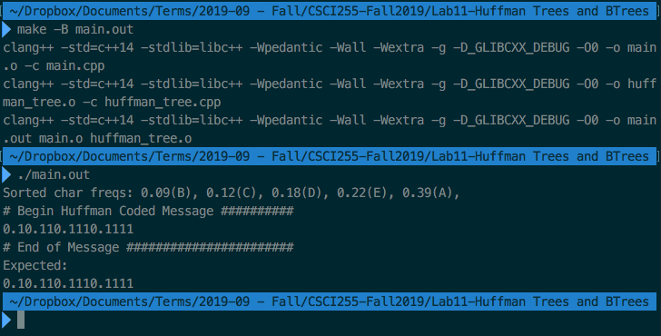
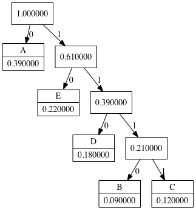

# Questions

## Q1. Huffman Trees
Given the following symbols and its frequency in an organization, construct
the Huffman tree and generate the Huffman code for following the symbols:

Symbols       A      B      C      D      E
---------- ------ ------ ------ ------ ------
Frequency    0.39   0.09   0.12   0.18   0.22

Submit the Huffman tree and the Huffman code for the symbols in question 1.

### Huffman Code

Result : `0.10.110.1110.1111`

See console sample for computed result.

### Console Sample
{width=100%}

### Huffman Tree Diagram
{width=45%}

![Expected Tree. Made on the [Huffman Tree Generator website][1].](./images/HuffmanTree-Expected.png){width=45%}

[1]: http://huffman.ooz.ie/?text=AAAAAAAAAAAAAAAAAAAAAAAAAAAAAAAAAAAAAAABBBBBBBBBCCCCCCCCCCCCDDDDDDDDDDDDDDDDDDEEEEEEEEEEEEEEEEEEEEEE
