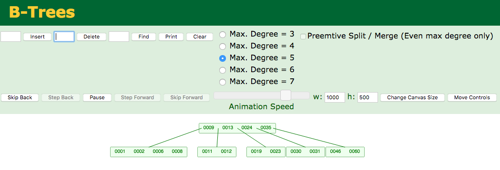

## Q2. B-Trees
B-Tree Visualization: https://www.cs.usfca.edu/~galles/visualization/BTree.html

### Insertions
Observe the process of B-tree insertion, inserting the following keys to
  a 5-way B-tree:
    3, 7, 9, 23, 46, 1, 5,
    15, 30, 24, 13, 11, 8, 19,
    4, 31, 35, 60, 2, 6, 12

{width=90%}

### Deletions
Observe the process of B-tree deletion: deleting the following keys from
  the above tree:
    4, 5, 7, 3, 15

{width=90%}
