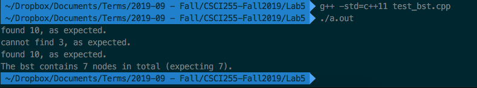

# Questions


## Question 1
What is the output from reverse() with input "CS255":

- input:  "CS255"
- output: "552SC"


## Question 2

Output from cubes with n=5 :
  "1 8 27 64 125 ".


Recursive definition of cubes:

```cpp
void recursiveCubes(int n) {
    if (n > 0) {
        recursiveCubes(n-1);
        cout << n * n * n << " ";
    }
}
```


## Question 3

Add the recursive implementations of `count` and `search` on BST. See code on following pages.

{width=100%}

