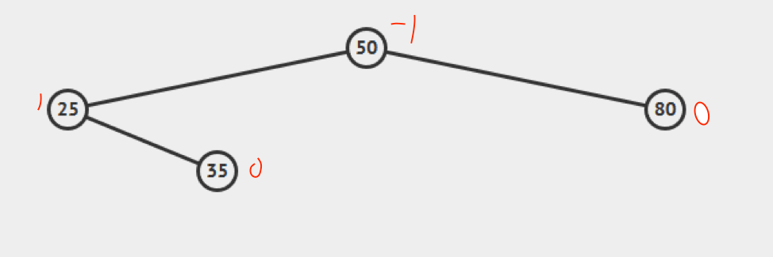

# Questions

## AVL Tree Insertions

Given the AVL Tree above, insert nodes in sequence to the tree. In each step,

- show the node(s) that becomes imbalanced if there is any,
- show the rotations that will fix the imbalance.

a) Insert 40

    ![Unbalanced after inserting 40.][i-a-40]

    ![Balanced after a Left Rotate at 25.][i-a-bal]

b) Insert 36

    ![Unbalanced after inserting 36.][i-b-36]

    ![Balanced after a Left Rotate at 35, then a Right Rotate at 50.][i-b-bal]

c) Insert 37

    ![Balanced after inserting 37.][i-c-37]

d) Insert 38

    ![Unbalanced after inserting 38.][i-d-38]

    ![Balanced after a Left Rotate at 36.][i-d-bal]

e) Insert 39

    ![Unbalanced after inserting 39.][i-e-39]

    ![Balanced after a Left Rotate at 35.][i-e-bal]

    This does match the expected state of the tree as seen on AVL animation website.

    ![Expected tree after all insertions.][i-e-exp]

[i-a-40]:  ./images/insert-a-40.png
[i-a-bal]: ./images/insert-a-balanced.png
[i-b-36]:  ./images/insert-b-36.png
[i-b-bal]: ./images/insert-b-balanced.png
[i-c-37]:  ./images/insert-c-37.png
[i-d-38]:  ./images/insert-d-38.png
[i-d-bal]: ./images/insert-d-balanced.png
[i-e-39]:  ./images/insert-e-39.png
[i-e-bal]: ./images/insert-e-balanced.png
[i-e-exp]: ./images/insert-final-expected.png

## AVL Tree Deletions

Delete the following nodes in sequence from the resulted tree in Q1 (use \
delete by copy). In each step,

- show the resulted tree after delete by copy and,
- show how to balance the tree if needed.

a) Delete 36

    ![Balanced tree after deleting 36.][d-a-36]

\pagebreak

b) Delete 35

    ![Balanced tree after deleting 35.][d-b-35]

c) Delete 40

    ![Unbalanced after deleting 40, the apex node.][d-c-40]

    \

    ![Balanced after a Left Rotate at 37, then a Right Rotate at 50.][d-c-bal]

    \

    ![Notice that this would be the result if your 'deleteByCopy' method did
      swap with successor instead of predecessor.][d-c-exp]

d) Delete 37 (e originally)

    ![Balanced tree after deleting 25.][d-d-37]

    This does not match the final tree made on AVL animation website but it is
    nonetheless correct. The implementation detail of how 'deleteByCopy' picks
    a node to swap with, either its successor or predecessor, results in a
    different layout.

    ![Expected final tree after all deletions from AVL website.][d-d-exp]

[d-a-36]:  ./images/delete-a-36.png
[d-b-35]:  ./images/delete-b-35.png
[d-c-40]:  ./images/delete-c-40.png
[d-c-bal]: ./images/delete-c-balanced.png
[d-c-exp]: ./images/delete-c-expected.png
[d-d-37]:  ./images/delete-d-37.png
[d-d-exp]: ./images/delete-final-expected.png

