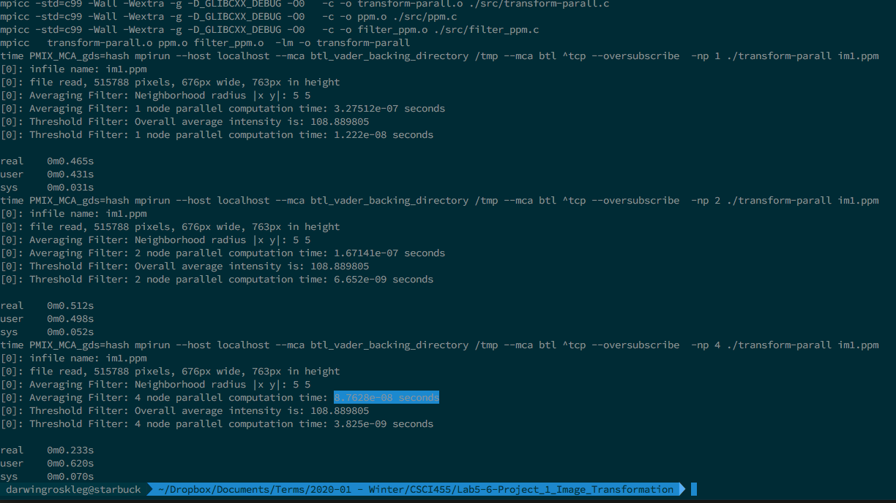
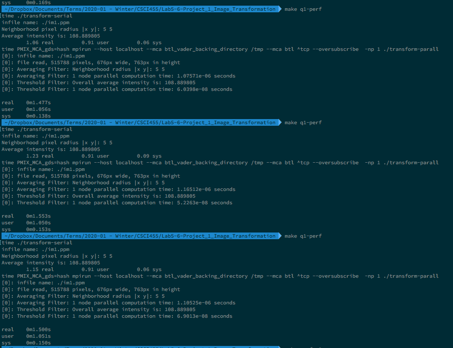
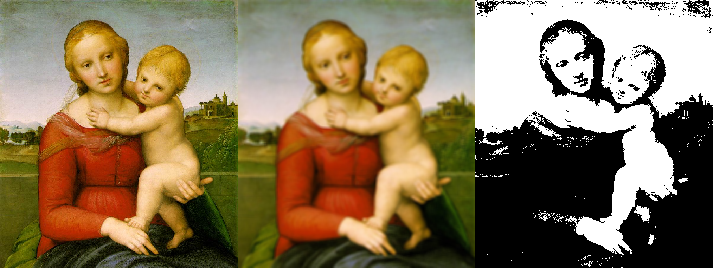
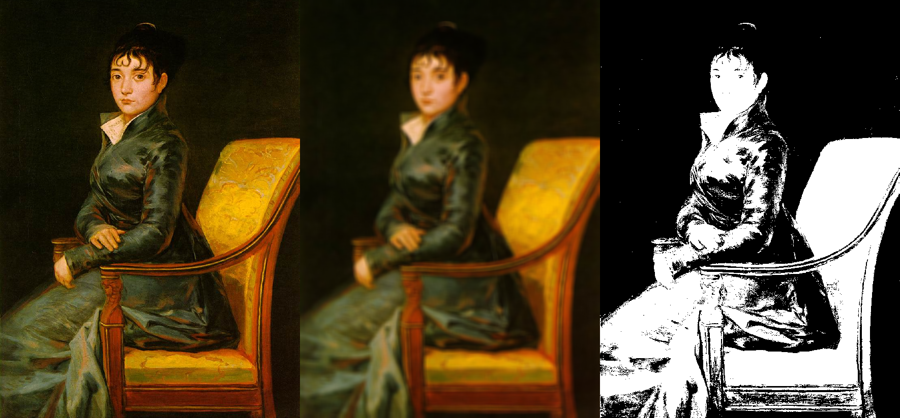
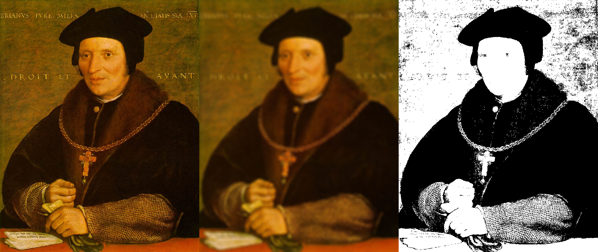

# Program Output

## Console

{ width=85% }

{ width=85% }

## Filtered Images
Images shown before and after filtering using parallel implementation.
Ordered original, fuzzy then threshold from the left.
Averaging filter used a radius of (x=5, y=5).

# Questions

## Q1. How does the single threaded perform in the serial vs parallel code?
Using the `time` command running both parallel (1 node) and serial on `im1.ppm` we get the following averages for **real** execution time in seconds:

  - Serial:   1.15 seconds (1.06,  1.23,  1.15)
  - Parallel: 1.51 seconds (1.477, 1.553, 1.500)

Four runs of the code in a row were made, throwing away the first where the data may not have been in the disk cache (mitigates outliers).
The resulting performance shows the serial code, without the extra unused machinery of MPI to setup, is faster than the single node execution of the parallel code.

## Q2. Which method of communication was implemented and why?
There are 3 areas of communication: loading the initial image file data, running the fuzzy transformation and running the threshold transformation. First, opening the image file is done by the  root process which then broadcasts the image data to all other processes. The fuzzy transformation only needs to communicate once, that is a Gather from all processes, their respective subset of the image data, to the root node. Finally, the threshold transformation communicates using All-Reduce in the calculation of the overall image intensity and then again with a Gather in the same way as the fuzzy transformation did.

## Q3. How does the parallel code scale with number of processors?
Program performance indexed by node count, tracked using `time`:

  - 1: real 0.465s
  - 2: real 0.512s
  - 4: real 0.233s

Below are the performance times of the individual transform algorithms as measured in the program using MPI's given performance functions `WTick()` and `WTime()`.

The "fuzzy transformation" scaled as follows:

  - 1: 3.27512 e-07 seconds
  - 2: 1.67141 e-07 seconds
  - 4: 0.87628 e-07 seconds

The "threshold transformation" scaled as follows:

  - 1: 1.222  e-08 seconds
  - 2: 0.6652 e-08 seconds
  - 4: 0.3825 e-08 seconds

# Further Improvements
Improvements that were not required but I believe would yield better performance
or speedup.

- Parallel I/O: use the MPI file I/O calls to read and write to the PPM image
  files. This would allow the expensive overhead of broadcasting (communicating)
  all the file data from the root process to the others. Especially true for the
  Averaging Filter. Most importantly this improves overall program performance.

- Pipe-lining with Cartesian Grid for communicating. Avoid calculating sums
  twice with the averaging filter.

# Code
See `src/transform-serial.c` for serial implementation (modified from prof. L.T. Yang). See `src/transform-parall.c` for the MPI/parallel implementation. All other sources files are used in both implementations. The `Makefile` is included to clarify how performance tests may have been conducted but personal/private makefiles libraries are not included in this document.
